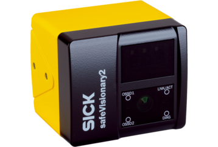

<div align="center">
  
  <h1 align="center">Sick Safevisionary ROS2</h1>
</div>

<p align="center">
  <a href="https://opensource.org/licenses/Apache-2.0">
    
  </a>
  <a href="https://github.com/SICKAG/sick_safevisionary_ros2/actions">
    
  </a>
  <a href="https://github.com/SICKAG/sick_safevisionary_ros2/actions">
    
  </a>
  <a href="https://github.com/SICKAG/sick_safevisionary_ros2/actions">
    
  </a>
</p>


This is the official ROS2 driver for the [Sick safeVisionary2](https://www.sick.com/de/en/safety-camera-sensors/safety-camera-sensors/safevisionary2/c/g568562) cameras.

## System dependencies
We use *Boost*'s [lock-free](https://www.boost.org/doc/libs/1_82_0/doc/html/lockfree.html) data structures in this driver.
You can install them with
```bash
sudo apt-get install libboost-all-dev
```

## Build and install
Switch to the `src` folder of your current ROS2 workspace and
```bash
git clone https://github.com/SICKAG/sick_safevisionary_ros2.git
git clone https://github.com/SICKAG/sick_safevisionary_base.git
rosdep install --from-paths ./ --ignore-src -y
cd ..
colcon build --packages-select sick_safevisionary_base sick_safevisionary_interfaces sick_safevisionary_driver  --cmake-args -DCMAKE_BUILD_TYPE=Release
```

## Getting started
Each camera must be configured once. The setup is explained [here](https://github.com/SICKAG/sick_safevisionary_base/blob/main/resources/doc/safety_designer.md).
In a sourced terminal, start the driver with
```bash
ros2 launch sick_safevisionary_driver driver_node.launch.py
```

You can list the relevant topics with
```bash
ros2 topic list | grep sick_safevisionary
```

This driver implements a *lifecycle node* which automatically transitions into the active state on bootup.
The state can also be manually changed for example from an unconfigured state to an active, publishing state using two additional steps on the command line.
Open another sourced terminal and call
```bash
ros2 lifecycle set /sick_safevisionary configure
ros2 lifecycle set /sick_safevisionary activate
```
Here's [more information](./sick_safevisionary_driver/README.md) about driver's lifecycle behavior.
